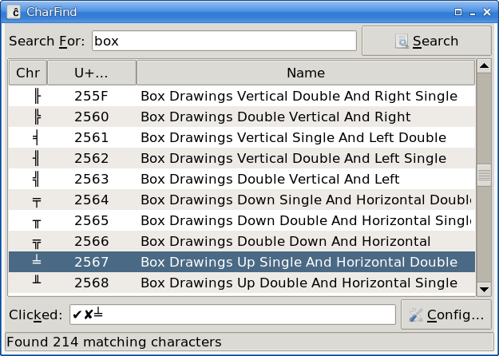

# CharFind

`charfind.tcl` is a GUI Unicode character finder.

Once installed you need to create the unicode character database
(`unidata.db`) the application depends on. To do this run:

`prepare_unidata.tcl`

This may take a few minutes to run.

Note: I use [Store](https://github.com/mark-summerfield/store) for version
control so github is only used to make the code public.

## Dependencies

Tcl/Tk >= 9.0.2; Tcllib >= 2.0; Tklib >= 0.9.

## License

GPL-3

---
